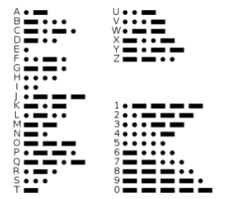
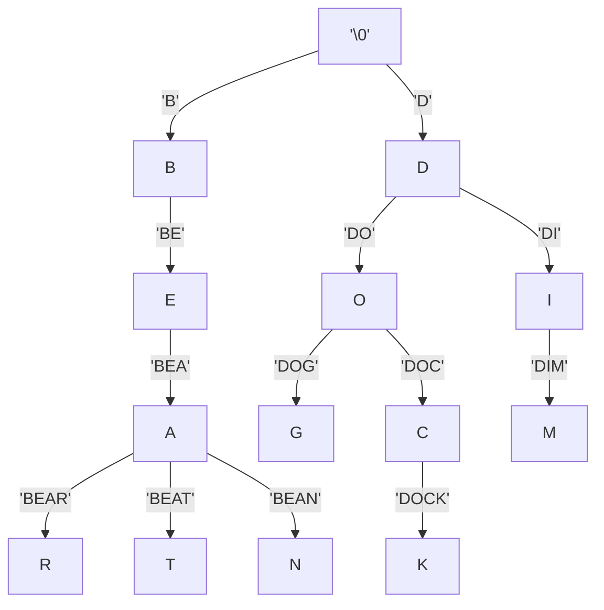
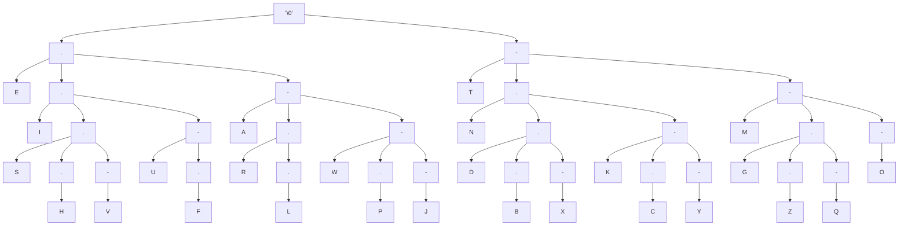
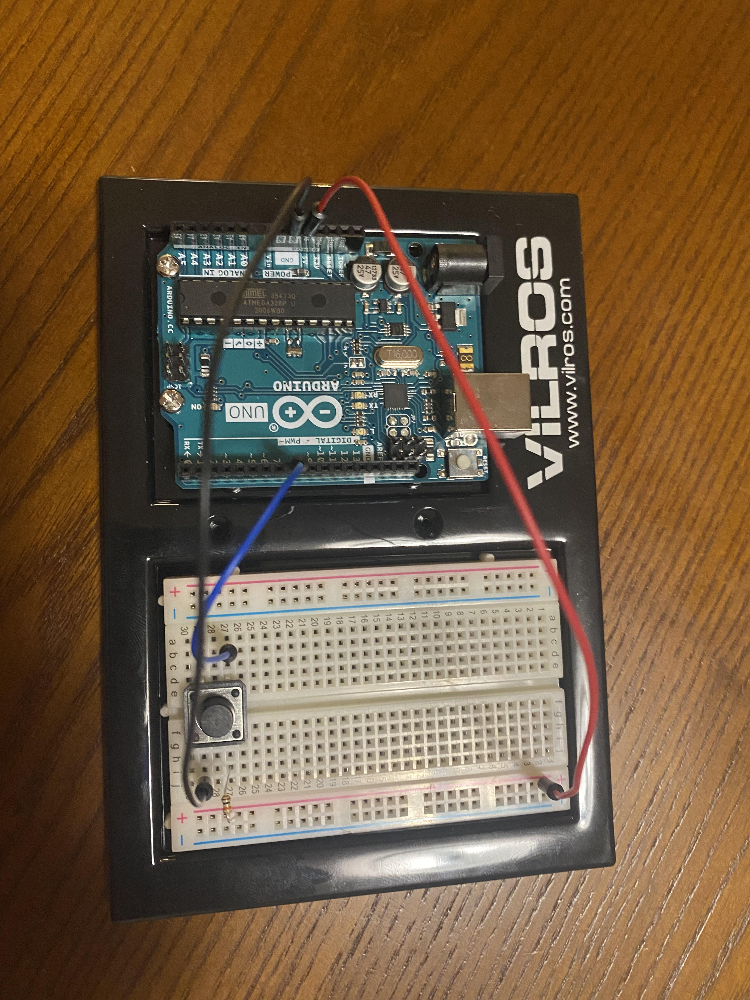

## Arduino Morse Code Decoder  
### Morse Code
Morse code is a method of encoding characters using signal duration. It was commonly used to send messages by telegraph, and is named after Samuel Morse, one of the inventors of the telegraph. The two basic units of time measurement in Morse Code are the "dot" (dit) and the "dash" (dah). Each letter in the alphabet is encoded as a unique sequence of dots and dashes, which allows for easy decoding. A dash is 3 times as long as a dot, and a space the length of a dash serves to separate the letters in a word. Here is a chart showing how the letters of the english alphabet are encoded:



### Tries
A trie is a data structure used to store strings efficiently. Tries use a tree structure to store each character of a string such that the string associated with a given node is a common prefix shared by all of that node's children. The root of a Trie is the empty string, and each child of the root contains the first character of all strings on whose path it is the first node visited. A string can be retrieved from a Trie via a depth-first traversal until the entire string has been found. Here is a simple example of a Trie (note that not all prefixes need to be actual words):


Since Morse Code encodes each letter as sequence of dots and dashes, we can use a Trie to efficiently store and look up the encodings!


Since we're just writing our code in C and only using the AVR library, we can use an array to store the trie. The decode() function takes the sequence input by the user (morse[]) and prints the corresponding character from the trie:
```
void decode() {
  int index = 0;
  int trieIndex = 0;
  while (morse[index] != '\0') {
    
    // dot = left child
    if (morse[index] == '.') {
      trieIndex = (trieIndex * 2) + 1;
    }
    
    // dash = right child
    else if (morse[index] == '-') {
      trieIndex = (trieIndex * 2) + 2;
    }
    index++;
  }
  Serial.print(trie[trieIndex]);
}
```
### Arduino
Now that we have our concept and data structure taken care of, we can start working with the Arduino. This project uses an Arduino Uno, which is a microcontroller board that uses the ATmega328p microcontroller. It has 14 digital I/O pins and 6 analog input pins. Some of the pins serve special purposes, such as the SCL and SDA pins, which can be used for I2C data transfer between devices. The full Arduino pinout diagram is shown below:


In addition to its various I/O pins, the Arduino has many internal registers that communicate with the pins, serve as timers and counters, and allow us to specify things such as clock speed and pulse width modulation. For this project we will need to interact with the Timer/Control counter register B (TCCR1b), the Timer Interrupt Mask Register (TIMSK1), the Timer Interrupt Flag Register (TIFR1), and the Timer Counter 1 (TCNT1). TCNT1 holds the current timer count, which we can use to track whether a dot or a dash was input by the user. TCNT1 is a 16-bit register and the Arduino system clock runs at 16MHZ, so the timer will turn over 256 times per second. This is much too fast for us to do anything useful with, so in the following code block we use TCCR1b to prescale (slow down) the system clock by a factor of 256. 
```
  TCCR1B |= (1 << CS12);
  TCCR1B &= ~(1 << CS11);
  TCCR1B &= ~(1 << CS10);
```

This means the timer will fill up once per second, which gives us plenty of time to distinguish between a dot and a dash. We also want to enable input capture interrupt, which allows us to specify the handler function when the user pushes or releases the push-button, and timer oveflow interrupt, so we can detect a space between letters if the timer overflows (which indicates that the button has not been pushed for a second).
The following code does this:
```
  // Set input capture select to falling edge
  TCCR1B &= ~(1 << ICES1);
  
  // enable input capture interrupt
  TIMSK1 |= (1 << ICIE1);
  // enable timer overflow interrupt
  TIMSK1 |= (1 << TOIE0);
```

Our input capture interrupt handler will be called whenever the button is pushed and when it is relased. When the button is pushed, we will record the value of the timer, and when it is released we can check how long the button was held for to determine whether a dot or a dash was the intended input. We will use 30-200ms to indicate a dot and 200-500ms to indicate a dash

```
// Input capture interrupt handler
ISR(TIMER1_CAPT_vect) {
  
  // Clear input capture flag
  TIFR1 |= (1 << ICF1);

  // Rising edge = button released
  if (TCCR1B & (1 << ICES1)) {
    
    // Set input capture edge select to falling edge
    TCCR1B &= ~(1 << ICES1);

    // Measure time between button push and release
    _stop = (_timer * 65536) + TCNT1;
    unsigned long int numTicks = _stop - _start;

    // 30ms to 200ms = dot
    if (numTicks >= 1875 && numTicks <= 12500) {
      morse[morseIndex] = '.';
      morseIndex++;
    }
    
    // 200ms to 500ms = dash
    else if (numTicks > 12500 && numTicks <= 31250) {
      morse[morseIndex] = '-';
      morseIndex++;
    }
    
    // Reset counter variables
    _start = 0;
    _stop = 0;
    _timer = 0;
  }

  // Falling edge = button pushed
  else {
    
    // Record time of button push
    TCCR1B |= (1 << ICES1);
    _start = (_timer * 65536) + TCNT1;
  }
}
```
Finally, our timer overflow handler can increment a timer variable in case the timer overflows while the button is being pushed. If it has been more than a second since the button was last pushed, we take that to indicate that the user has finished inputting the current letter, and call our decode() function to find and output the letter.

```
// Timer Overflow Interrupt Handler
ISR(TIMER1_OVF_vect) {
  _timer++;

  // 1 second without button push = letter received
  if (((_timer * 65536) - _start) > 65536) {
    morse[morseIndex] = '\0';
    decode();
    morseIndex = 0;
  }
  
  // Clear timer overflow flag
  TIFR0 |= (1 << TOV0);
}
```

As far as actually wiring the circuit, we only need a breadboard, a pushbutton, a 10K ohm resistor, and a wire each to connect the pushbutton to power, ground, and the input pin (in this case it is digital pin 8 or PB0). The circuit is shown below:

