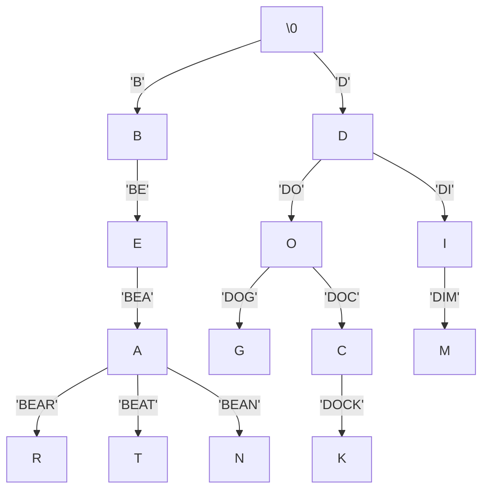

## Arduino Morse Code Decoder  
### Morse Code
Morse code is a method of encoding characters using signal duration. It was commonly used to send messages by telegraph, and is named after Samuel Morse, one of the inventors of the telegraph. The two basic units of time measurement in Morse Code are the "dot" (dit) and the "dash" (dah). Each letter in the alphabet is encoded as a unique sequence of dots and dashes, which allows for easy decoding. A dash is 3 times as long as a dot, and a space the length of a dash serves to separate the letters in a word. Here is a chart showing how the letters of the english alphabet are encoded:


### Tries
A trie is a data structure used to store strings efficiently. Tries use a tree structure to store each character of a string such that the string associated with a given node is a common prefix shared by all of that node's children. The root of a Trie is the empty string, and each child of the root contains the first character of all strings on whose path it is the first node visited. A string can be retrieved from a Trie via a depth-first traversal until the entire string has been found. Here is a simple example of a Trie (note that not all prefixes need to be actual words):


Since Morse Code encodes each letter as sequence of dots and dashes, we can use a Trie to efficiently store and lookup the encodings!
```mermaid
graph TD;
\0 --> B[.]
B[.] --> C[\emptyset]

```
